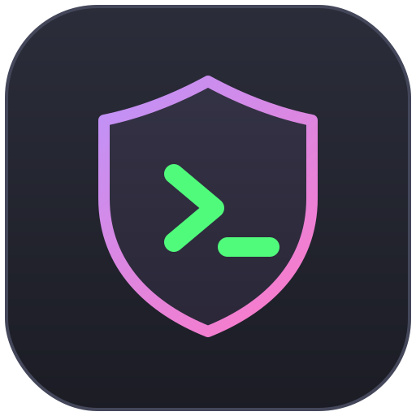
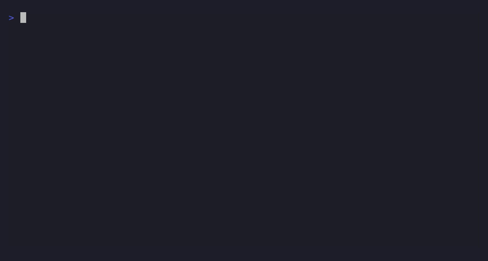

<p align="center">
  
</p>

<h1 align="center">Vibe Coding Template</h1>

<p align="center">
  
  
  
</p>

<p align="center">
  <strong>Your AI coding agent just tried to delete your database.</strong><br/>
  <strong>This stops it.</strong>
</p>

<p align="center"><em>Go ahead, code purely on vibes. The CI gate and safety hooks will catch you if you fall.<br/>A drop-in rule set + hooks that make Claude Code, Cursor, Windsurf, and Copilot behave like a disciplined senior engineer — not a reckless speed demon.</em></p>

<p align="center">
  <a href="#quick-start">⚡ Setup: 2 minutes</a> • 
  <a href="#what-this-does">🛑 See what it blocks</a> • 
  <a href="#presets">🏗️ Works with any stack</a>
</p>

---

### The Problem Every Dev Faces

AI agents are **fast** but **reckless**:
- ✗ Claim "this should work" without proof → you ship untested code
- ✗ Overcomplicate: 1000 lines where 100 would do
- ✗ Edit files they shouldn't touch → you revert bad code
- ✗ Read `.env` + print secrets to chat → your keys are compromised
- ✗ Run `rm -rf /` or `DROP TABLE` without WHERE → your data is gone
- ✗ Different rules for Cursor vs Claude vs Copilot → chaos

### What This Does

This is not a framework. It's a **set of plain files** (rules + hooks + CI) you drop into your project:

| Problem | Solution |
|---------|----------|
| "This should work" | **Mandatory test gate:** typecheck + lint + test + build, all green before commit |
| Over-engineering | **File-size budgets** enforced in CI — god-files get split before they metastasize |
| Scope drift | **Scope lock:** agent states which files change BEFORE editing anything |
| Session death = lost work | **Per-edit commits + auto-push** — crashed session loses ~nothing |
| Secret leaks + destructive commands | **Permission deny-list + hooks** block `rm -rf`, `DROP TABLE`, `cat .env`, etc. |
| Rule chaos (different per agent) | **Single source of truth:** `AGENTS.md` → auto-generates config for every agent |

**Result:** Your AI agent behaves like a senior engineer, not a burnout shipping broken code at 3 AM.

### 🧠 Stop prompting for code. Start prompting for contracts.

Most AI templates tell the model to "write the app". This template enforces a **hybrid methodology**:
- **New APIs:** Spec-Driven Development (write the Zod contract first).
- **Business Logic:** Test-Driven Development (red → green → refactor).
- **Legacy Code:** Characterization Tests (lock behavior before refactoring).

[Read the full methodology below.](#methodology--baked-in-not-bolted-on)

---

It's MIT. Use it, fork it, ship it. No import, no dependency, no lock-in.

---

## Demo



*Your AI agent's destructive and secret-leaking commands (`rm -rf`, `DROP TABLE`, `cat .env`) are blocked before they run. Reproduce or regenerate this GIF with [`demo/demo.tape`](demo/demo.tape).*

---

## 🌌 See your codebase as a graph (Obsidian)

> **📸 Tip for you:** *Drop a screenshot or GIF of your Obsidian graph view here! E.g. ``*

Agents navigate by structure, not grep. `graphify` maps your whole codebase into a knowledge graph—one note per file/function, wikilinked by who-calls-what. The agent uses this to answer "where is X" without burning tokens, and outputs an **Obsidian vault** so you can fly around your architecture visually. [Learn more below.](#see-your-codebase-as-a-graph-obsidian)

---

## Works with

- **Agents:** Claude Code, Cursor, Windsurf, GitHub Copilot, Google Antigravity, Aider, and any agent that reads `AGENTS.md`.
- **OS:** Windows (PowerShell), macOS, Linux (bash). Hooks and scripts are Node.js — cross-platform.
- **Stacks (presets):** `web` (React/Vite), `fullstack` (Next.js + Prisma), `mobile` (Flutter), `desktop` (Tauri). Easy to add more.

**One honest caveat:** *local* automated enforcement (hooks + permission deny-list) runs only under **Claude Code**. Every other agent reads the same rules as guidance and relies on self-discipline — plus the **CI gate**, which re-checks everything on push regardless of which agent made the edit.

---

## Quick start

There are two ways to use it. Pick one.

### Option A — Tell your AI agent to set it up (works for new *or* existing projects)

This is the whole point: you don't have to wire anything by hand. Clone this repo somewhere, then point your agent at it and paste a prompt like:

```
Read the files in <path-to-this-repo>/template and apply this Vibe Coding
Template to my project. Specifically:
1. Copy the universal files (.claude/, AGENTS.md, the generated agent shims,
   scripts/, .github/workflows/, docs/, PROGRESS.md, file-budgets.json).
2. Pick the preset that matches my stack (web / fullstack / mobile / desktop)
   and copy its CLAUDE.md, commands.json, file-budgets.json, and CI workflow.
3. Fill in the [BRACKETED] placeholders in CLAUDE.md from what you can infer
   about my project. Ask me only what you can't determine.
4. Add the e2e scaffold if this is a web/fullstack project.
5. Do NOT overwrite files I already have without showing me a diff first.
```

Because everything is plain files, **any** agent can do this — not just Claude Code.

### Option B — Run the setup script (deterministic)

From the root of your project folder:

```bash
# macOS / Linux / Git Bash
bash /path/to/vibe-coding-template/template/setup.sh web

# Windows PowerShell
pwsh C:\path\to\vibe-coding-template\template\setup.ps1 web
```

Replace `web` with `fullstack`, `mobile`, or `desktop` (omit it to choose interactively). The script copies the universal files, overlays the preset, sets up `.gitignore` + `.env.example`, and initializes `PROGRESS.md`. Existing files are skipped, never clobbered.

After either option: open `CLAUDE.md`, fill in the `[BRACKETED]` sections, and start coding.

---

## What you get

```
your-project/
├─ AGENTS.md                      # Canonical rules — every agent reads this
├─ CLAUDE.md                      # Claude Code brain (preset-specific) + your project facts
├─ .cursorrules                   # Generated from AGENTS.md (Cursor, legacy)
├─ .cursor/rules/project.mdc      # Generated (Cursor, modern Project Rules)
├─ .windsurfrules                 # Generated (Windsurf)
├─ .github/
│  ├─ copilot-instructions.md     # Generated (GitHub Copilot)
│  └─ workflows/ci.yml            # CI gate: lint, types, test, build, file-size
├─ .claude/
│  ├─ settings.json               # Permission allow/deny-list + hook wiring
│  ├─ hooks/                      # Pre/post tool hooks (destructive-cmd + secret block, file-size, DB guard, auto-push)
│  ├─ rules/                      # Path-scoped deep rules (api, database, testing, refactor, …)
│  ├─ commands/                   # Slash commands (/resume, /checkpoint, /next-phase, /autonomous, …)
│  ├─ agents/                     # Subagents (code-reviewer, debugger, security-auditor, …)
│  └─ skills/                     # caveman-default (token-saving), design-system
├─ e2e/                           # Playwright scaffold (web/fullstack) — auth setup + example spec
├─ scripts/                       # check-file-sizes, sync-agent-rules, graphify-bootstrap, …
├─ docs/                          # Plain-language templates for non-coder maintainers
├─ PROGRESS.md                    # Live phase tracker + session-resume protocol
└─ file-budgets.json              # Per-file-type LOC limits (CI-enforced)
```

### The headline features

- **Single-source rules.** Edit `AGENTS.md`; run `node scripts/sync-agent-rules.mjs`; every agent's config regenerates. No drift.
- **Safety hooks (Claude Code).** Block `rm -rf /`, `DROP TABLE`, `DELETE` without `WHERE`, `git reset --hard HEAD~N`, and reading/printing secret files (`.env`, `.dev.vars`, `*.key`…). Warn on risky migrations.
- **Death-defense workflow.** Per-edit commits with `wip(phase):` prefixes, an auto-push hook, and a session-resume protocol mean a crashed or rate-limited session loses ~nothing. `/resume` picks up exactly where it stopped.
- **Test-before-commit gate.** No "I think it works." Typecheck **and** build (they catch different bugs), tests, file-size check — all green before commit.
- **File-size budgets.** Soft warning + hard CI failure per file type, so god-files get split *before* they metastasize.
- **Methodology baked in.** A hybrid **SDD + TDD + Characterization** strategy — the agent picks the right one per task. [See below.](#methodology--baked-in-not-bolted-on)
- **Token-aware autonomy.** `/autonomous` loops through phases and bails gracefully at a safe checkpoint when the context budget gets tight.
- **Knowledge graph you can *see*.** `graphify` maps the codebase so agents navigate by structure instead of grepping — and writes an **Obsidian vault** you can explore visually. [See below.](#see-your-codebase-as-a-graph-obsidian)
- **Plain-language docs.** Generators for HANDOVER / ARCHITECTURE / FINDINGS docs aimed at non-coder project owners.

Also included: [`VIBE_CODING_PROMPT.md`](VIBE_CODING_PROMPT.md) — a standalone "senior engineer" system prompt you can paste as a `CLAUDE.md` if you want the philosophy without the full scaffold.

---

## Methodology — baked in, not bolted on

New code and legacy code need different testing strategies, so the template encodes a **hybrid** approach and the agent picks the right layer automatically (full detail + code examples in [`.claude/rules/methodology.md`](template/.claude/rules/methodology.md)):

| You're building… | Layer | What the agent does |
|---|---|---|
| A new API route | **SDD** (spec-driven) | Writes a Zod contract *before* the handler — the schema is the docs **and** the inferred TS type the frontend imports |
| New service / business logic | **TDD** (test-driven) | Red → green → refactor: failing test first, minimum code to pass, then clean up |
| A new UI component | Component test | Render + interaction (Testing Library) |
| Refactoring legacy code | **Characterization** | Locks current behavior in a test *before* the move; the same test must pass after |
| A bug fix | **TDD regression** | A test that fails before the fix and passes after |

E2E (Playwright) ships as a runnable scaffold for `web` / `fullstack`. Backend tests hit a **real** test database — mocking the DB is forbidden (mocks invent behavior; real bindings catch SQL bugs). Coverage floor and a test-before-commit gate are enforced in CI.

> **Not included by design: BDD** (Gherkin / Cucumber). The SDD + TDD + Characterization stack covers contracts, logic, and regressions without a separate spec language. Add a BDD layer per-project if your team relies on Given-When-Then.

---

## See your codebase as a graph (Obsidian)

`graphify` maps your whole codebase into a knowledge graph — one note per file/function, wikilinked by who-calls-what, grouped into communities. It's already wired into the template: a `/graphify` command, a `graphify-bootstrap.mjs` script, and a `graph-navigator` subagent. Two payoffs:

- **Agents navigate by structure, not grep.** Once `graphify-out/GRAPH_REPORT.md` exists, the agent reads the graph to answer "where is X / what calls Y" instead of burning tokens on repo-wide `grep` (cuts exploration ~60–80%).
- **You explore it visually in Obsidian.** `graphify` writes its output *as an Obsidian vault* — `graphify-out/` ships with an `.obsidian/` config and a markdown note per symbol. Open that folder as a vault and use Obsidian's **Graph View** to fly around your architecture.

```bash
# generate / refresh the graph (auto-installs graphify if Python is present)
node scripts/graphify-bootstrap.mjs        # or the /graphify slash command in Claude Code

# then in Obsidian:  "Open folder as vault"  →  <your-project>/graphify-out
```

`graphify-out/` is gitignored (it's regenerated, not committed), so it never bloats your repo. Re-run `/graphify` after big structural changes to keep the graph fresh.

---

## Updating the rules

`AGENTS.md` is the **only** file you edit by hand. The per-agent configs are generated:

```bash
# after editing AGENTS.md
node template/scripts/sync-agent-rules.mjs
```

This rewrites `.cursorrules`, `.cursor/rules/project.mdc`, `.windsurfrules`, and `.github/copilot-instructions.md`. Never hand-edit those — your changes get overwritten.

---

## Presets

| Preset | Stack | Unit / Integration | E2E |
|---|---|---|---|
| `web` | React + Vite + TS + Tailwind | Vitest + Testing Library | Playwright |
| `fullstack` | Next.js + Prisma + PostgreSQL | Vitest (real test DB) | Playwright |
| `mobile` | Flutter (Dart) | flutter_test | integration_test |
| `desktop` | Tauri (Rust + React) | Vitest + cargo test | Playwright via tauri-driver |

Each preset ships its own `CLAUDE.md`, `commands.json`, `file-budgets.json`, and CI workflow.

---

## FAQ

**Do I have to use Claude Code?** No. The rules work with any agent. Claude Code just gets the extra *automated* enforcement layer (hooks). Everyone gets the rules + CI.

**Will it touch my existing code?** Setup never overwrites existing files (it skips them). The agent-driven path is instructed to show diffs before changing anything you already have.

**Is this a dependency?** No. It's plain config + scripts. Delete any file you don't want.

**Why both `tsc` and a build step in the gate?** They catch different errors — `tsc` misses things like duplicate declarations that the bundler flags, and vice versa. Running only one ships broken code.

---

## Contributing

Issues and PRs welcome — especially new presets, a tool-agnostic pre-commit gate, and more `.mdc` rule splits for Cursor. See [CONTRIBUTING.md](CONTRIBUTING.md). Licensed under [MIT](LICENSE).
